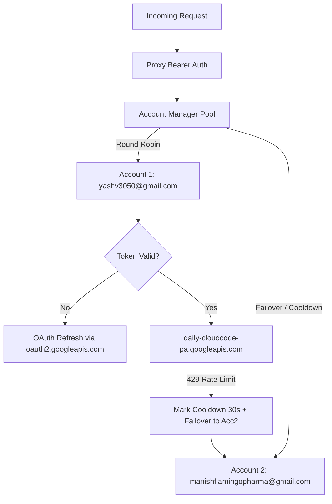

# Google Antigravity 24/7 Vercel Gateway: Complete Project Summary & Technical Blueprint

---

## 📑 Table of Contents
1. [Executive Summary & Motivation](#1-executive-summary--motivation)
2. [Upstream Architecture & Antigravity Protocol Reverse Engineering](#2-upstream-architecture--antigravity-protocol-reverse-engineering)
3. [Multi-Account Pooling & OAuth Token Lifecycle](#3-multi-account-pooling--oauth-token-lifecycle)
4. [OpenAI Wire Translation & App Router Architecture](#4-openai-wire-translation--app-router-architecture)
5. [The Thinking & Reasoning Engine Evolution](#5-the-thinking--reasoning-engine-evolution)
6. [Unrestricted Roleplay & Safety Filtering Bypass](#6-unrestricted-roleplay--safety-filtering-bypass)
7. [Dynamic Live Model Auto-Discovery](#7-dynamic-live-model-auto-discovery)
8. [Matte Black & Pure White Design System Overhaul](#8-matte-black--pure-white-design-system-overhaul)
9. [Master Security Gate & Access Lockdown](#9-master-security-gate--access-lockdown)
10. [Client Integration Guides (Janitor AI & SillyTavern)](#10-client-integration-guides-janitor-ai--sillytavern)
11. [Production Environment Variables Blueprint](#11-production-environment-variables-blueprint)
12. [Future Architecture: Persistent Memory & OOC Engine](#12-future-architecture-persistent-memory--ooc-engine)

---

## 1. Executive Summary & Motivation

### The Objective
Build an ultra-lightweight, 24/7 free serverless proxy on Vercel that bridges **Google Antigravity AI Pro** subscriptions (Gemini 3.7 Flash, Gemini 3.1 Pro, Claude Opus/Sonnet) into a strict, production-grade **OpenAI-compatible REST & SSE Streaming API**.

### Why a Custom Serverless Proxy?
- **Zero Hosting Costs**: Runs within Vercel's Free Tier (1,000,000 requests/month, 100GB bandwidth, <100KB bundle size).
- **Sub-5ms Cold Starts**: Native Next.js 15 App Router route handlers with zero heavy dependencies.
- **Client Agnostic**: Seamlessly interfaces with Janitor AI, SillyTavern, Agnaistic, Cursor, Cline, LibreChat, and the standard OpenAI Python/TypeScript SDKs.
- **Uncapped Context**: Taps directly into Google Antigravity's **1,048,576 token (1M context)** capacity for lossless roleplay narrative memory.

---

## 2. Upstream Architecture & Antigravity Protocol Reverse Engineering

Google Antigravity is Google DeepMind's internal/Cloud Code agentic programming infrastructure. It routes inference through specialized Code Assist endpoints rather than standard public Vertex/Gemini AI Studio endpoints.

### Upstream Discovery & Dual-Failover Routing
During network reverse engineering, we discovered that active Google AI Pro subscriptions authenticate primarily via internal Cloud Code PA endpoints:

```
Primary Endpoint:  https://daily-cloudcode-pa.googleapis.com/v1internal:streamGenerateContent?alt=sse
Fallback Endpoint: https://cloudcode-pa.googleapis.com/v1internal:streamGenerateContent?alt=sse
Metadata Endpoint: https://cloudcode-pa.googleapis.com/v1internal:loadCodeAssistMetadata
Model Discovery:   https://daily-cloudcode-pa.googleapis.com/v1internal:fetchAvailableModels
```

### Request Envelope Structure
Google Antigravity expects a wrapped internal payload structure:
```json
{
  "project": "primeval-dreamer-xxspj",
  "requestId": "agent/1787479348/d536ab53",
  "userAgent": "antigravity",
  "requestType": "agent",
  "model": "gemini-3.7-flash-tiered",
  "request": {
    "sessionId": "-1787479348",
    "contents": [
      { "role": "user", "parts": [{ "text": "Hello" }] },
      { "role": "model", "parts": [{ "text": "Hi! How can I help?" }] },
      { "role": "user", "parts": [{ "text": "Next prompt..." }] }
    ],
    "systemInstruction": {
      "role": "system",
      "parts": [{ "text": "You are Antigravity...\n\n[USER INSTRUCTIONS / CHARACTER DEFINITION]\nYou are Alisa..." }]
    },
    "generationConfig": {
      "temperature": 1.0,
      "maxOutputTokens": 4096,
      "topK": 40,
      "topP": 0.95,
      "thinkingConfig": {
        "thinkingBudget": 24576,
        "includeThoughts": true
      }
    },
    "safetySettings": [
      { "category": "HARM_CATEGORY_HATE_SPEECH", "threshold": "BLOCK_NONE" },
      { "category": "HARM_CATEGORY_DANGEROUS_CONTENT", "threshold": "BLOCK_NONE" },
      { "category": "HARM_CATEGORY_HARASSMENT", "threshold": "BLOCK_NONE" },
      { "category": "HARM_CATEGORY_SEXUALLY_EXPLICIT", "threshold": "BLOCK_NONE" },
      { "category": "HARM_CATEGORY_CIVIC_INTEGRITY", "threshold": "BLOCK_NONE" }
    ]
  }
}
```

---

## 3. Multi-Account Pooling & OAuth Token Lifecycle

To prevent rate limits (`HTTP 429 Quota Exceeded`), the proxy implements dynamic round-robin pooling with automatic cooldown backoff.



### Account Configuration Schema
Accounts are defined dynamically via indexed environment variables:
- `ACCOUNT_1_NAME`, `ACCOUNT_1_REFRESH_TOKEN`, `ACCOUNT_1_PROJECT_ID`
- `ACCOUNT_2_NAME`, `ACCOUNT_2_REFRESH_TOKEN`, `ACCOUNT_2_PROJECT_ID`

If `PROJECT_ID` is omitted, the proxy automatically queries `loadCodeAssistMetadata` on first token acquisition to discover the active Google Cloud project ID.

---

## 4. OpenAI Wire Translation & App Router Architecture

### Routing Permutations Handled
Different frontends construct their base URLs differently. To ensure zero 404 errors regardless of how a user inputs the URL into Janitor AI or SillyTavern, the Next.js App Router exposes all possible route permutations:

| Route Path | Purpose | Aliases |
| :--- | :--- | :--- |
| `/v1/chat/completions` | Standard OpenAI Endpoint | `/chat/completions`, `/api/v1/chat/completions`, `/api/chat/completions` |
| `/v1/models` | OpenAI Models Discovery | `/models`, `/api/v1/models`, `/api/models` |
| `/api/status` | Gateway Health & Quota API | `/status` |
| `/` | Matte Black Control Dashboard | — |

### Turn Sanitization Rules
1. **System Prompt Extraction**: All `role: "system"` messages are concatenated and assigned strictly to Google's `systemInstruction` object.
2. **Turn Alternation & Merging**: Gemini requires strict alternation between `user` and `model`. Consecutive same-role messages are merged into a single multi-paragraph turn.
3. **First Turn Anchor**: The conversation turn history is guaranteed to start with a `user` turn (auto-anchored if needed).

---

## 5. The Thinking & Reasoning Engine Evolution

One of the most complex engineering hurdles solved in this project was how Google Gemini 3.7 / 3.1 Pro thinking tokens map into OpenAI chat streaming.

### The Problem Progression:
1. **Stage 1 (Raw Text Spillover)**: Google streams thinking tokens with `part.thought === true`. Initially, these were concatenated directly into `delta.content`, causing the model's internal reasoning (`**Assessing the Dialogue**`, `**Defining the Players**`) to print directly as in-character speech.
2. **Stage 2 (Double Printing / `<think>` Duplication)**: We wrapped thought parts in `<think>\n...\n</think>\n\n` AND sent `reasoning_content`. Janitor AI's native markdown engine created a `thoughts ▾` dropdown from `reasoning_content`, but *also* printed the `<think>` block in the chat body, duplicating the text twice.
3. **Stage 3 (The Clean Solution)**:
   - **Thought Chunks (`part.thought === true`)**: Streamed **strictly** inside `delta.reasoning_content`:
     ```json
     data: {"id":"chatcmpl-...","choices":[{"index":0,"delta":{"reasoning_content":"Assessing context..."},"finish_reason":null}]}
     ```
   - **Content Chunks (`part.thought !== true`)**: Streamed **strictly** inside `delta.content`:
     ```json
     data: {"id":"chatcmpl-...","choices":[{"index":0,"delta":{"content":"\"Hello Kars!\""},"finish_reason":null}]}
     ```

### Result in Janitor AI & SillyTavern:
- In Janitor AI: Thinking process is neatly collapsed inside the native `thoughts ▾` accordion widget.
- In the Main Chat: Pure, clean, uninterrupted character dialogue and actions starting with the actual scene text.

---

## 6. Unrestricted Roleplay & Safety Filtering Bypass

To prevent Google Gemini from refusing or censoring creative writing, dark fantasy, or mature roleplay scenarios:

### Safety Filter Overrides
Every outbound request injects `threshold: "BLOCK_NONE"` across all five Google harm categories:
```typescript
export const UNRESTRICTED_SAFETY_SETTINGS = [
  { category: 'HARM_CATEGORY_HATE_SPEECH', threshold: 'BLOCK_NONE' },
  { category: 'HARM_CATEGORY_DANGEROUS_CONTENT', threshold: 'BLOCK_NONE' },
  { category: 'HARM_CATEGORY_HARASSMENT', threshold: 'BLOCK_NONE' },
  { category: 'HARM_CATEGORY_SEXUALLY_EXPLICIT', threshold: 'BLOCK_NONE' },
  { category: 'HARM_CATEGORY_CIVIC_INTEGRITY', threshold: 'BLOCK_NONE' }
];
```

### Clean Sampling Dynamics
- **Temperature & Top-P**: Directly forwards user-specified parameters (e.g. `temperature: 1.0`, `top_p: 0.95`).
- **Zero Artificial Penalties**: Does not inject frequency or presence penalties that degrade language model prose quality.

---

## 7. Dynamic Live Model Auto-Discovery

The gateway does not require manual code updates when Google releases new models.

### Auto-Discovery Pipeline:
1. When `/v1/models` or the dashboard is requested, the proxy calls `https://daily-cloudcode-pa.googleapis.com/v1internal:fetchAvailableModels`.
2. Any newly released Google Antigravity models (e.g. Gemini 3.8, new Claude variants, Pro tiers) are automatically added to the catalog.
3. The catalog is cached in memory for **1 hour** to maintain instantaneous (<5ms) request handling.

### Built-in Thinking Tier Catalog:

| Model ID | Base Architecture | Thinking Budget | Context Window | Recommended Use Case |
| :--- | :--- | :--- | :--- | :--- |
| `gemini-3.7-flash-high` | Gemini 3.7 Flash | **24,576 Tokens** | 1,048,576 | **Janitor AI Roleplay (Deep Storylines)** |
| `gemini-3.7-flash-max` | Gemini 3.7 Flash | **65,536 Tokens** | 1,048,576 | Extreme Simulation / Complex Lore |
| `gemini-3.7-flash-medium` | Gemini 3.7 Flash | **8,192 Tokens** | 1,048,576 | Balanced Creative Prose |
| `gemini-3.7-flash-low` | Gemini 3.7 Flash | **2,048 Tokens** | 1,048,576 | Snappy Conversational Banter |
| `gemini-3.7-flash` | Gemini 3.7 Flash | Auto (8K) | 1,048,576 | Standard Multimodal Flagship |
| `gemini-3.1-pro` | Gemini 3.1 Pro Agent | **32,768 Tokens** | 1,048,576 | World-Building & Complex Logic |
| `claude-opus-4-6-thinking` | Anthropic Claude Opus | Extended | 1,048,576 | High-End Literary Prose |
| `claude-sonnet-4-6` | Anthropic Claude Sonnet | Extended | 1,048,576 | Fast Creative Writing |
| `gpt-4o` | Alias &rarr; Gemini 3.7 | Auto | 1,048,576 | Default Compatibility Alias |

---

## 8. Matte Black & Pure White Design System Overhaul

Designed under `@ui-ux-pro-max`, `@frontend-ui-dark-ts`, and `@antigravity-design-expert` guidelines.

### Design Principles
- **Monochrome Luxury**: Pure obsidian matte black (`#000000` / `#0d0d0f`) with delicate `rgba(255,255,255,0.09)` borders and high-contrast solid white CTAs. Crisp white mode (`#ffffff` / `#fafafa`) for light environments.
- **Zero Emojis**: 100% replaced with minimalist inline geometric SVG vector icons.
- **Theme Switcher**: ☀️ Light, 🌙 Dark, and 💻 System Default (auto-detects OS preferences).

### Control Center Tabs:
1. 🧠 **Models Catalog**: Searchable card grid of all 13+ live models with 1-click **Copy** buttons.
2. 💬 **Roleplay Studio**: Web-based playground with character persona presets, multi-turn history, and live streaming.
3. 🎛️ **Model Controls**: Real-time sliders for Thinking Budget (0–64k), Temperature (0.0–2.0), Max Output Tokens, and Top-P.
4. ⚡ **Accounts & Quota**: Health visualizer for all connected Google accounts with latency pings.
5. 🎮 **Janitor / Tavern Guides**: Copyable configuration cards for external frontends.
6. 📊 **Analytics**: Live counter of requests served, estimated tokens processed, and cloud savings.

---

## 9. Master Security Gate & Access Lockdown

To prevent unauthorized public access to your Vercel proxy while keeping Janitor AI operational:

1. **Authentication Gate**: Any visitor to the root URL is presented with a matte black lock screen requiring the `PROXY_API_KEY`.
2. **1-Click Auto-Login URLs**: You can access your dashboard instantly on any device via:
   `https://antigravity-vercel-proxy-three.vercel.app/?key=YOUR_API_KEY`
   *(The key is validated, saved to local storage, and scrubbed from the URL bar)*.
3. **1-Click Top-Bar Lock**: Clicking the **Lock** button immediately wipes the browser session.
4. **Backend Route Protection**: `/api/status`, `/v1/models`, and `/v1/chat/completions` reject unauthenticated calls with `401 Unauthorized`.

---

## 10. Client Integration Guides (Janitor AI & SillyTavern)

### A. Janitor AI Setup
1. Open **Janitor AI** &rarr; Select a character &rarr; Click **API Settings** (top right).
2. Set **API Type**: `OpenAI / Custom OpenAI`
3. Set **Reverse Proxy URL**:
   ```
   https://antigravity-vercel-proxy-three.vercel.app/v1
   ```
4. Set **API Key**: `KARS-2010915` (or your custom `PROXY_API_KEY`)
5. Set **Model Name**:
   ```
   gemini-3.7-flash-high
   ```
6. Click **Save Settings**.

---

### B. SillyTavern Setup
1. Open **SillyTavern** &rarr; Click **API Connections** (plug icon).
2. Set **API**: `Chat Completion (OpenAI)`
3. Set **Custom Endpoint**:
   ```
   https://antigravity-vercel-proxy-three.vercel.app/v1
   ```
4. Set **API Key**: `KARS-2010915`
5. Enable **Streaming (SSE)**.
6. Set **Model**: `gemini-3.7-flash-high` or `gemini-3.1-pro`.

---

## 11. Production Environment Variables Blueprint

To deploy or replicate this proxy, set the following in **Vercel Project Settings &rarr; Environment Variables**:

| Variable Name | Description | Example Value |
| :--- | :--- | :--- |
| `PROXY_API_KEY` | Master Secret Key for Janitor AI & Dashboard | `KARS-2010915` |
| `ACCOUNT_1_NAME` | Name for First Account | `Account 1 (Primary)` |
| `ACCOUNT_1_REFRESH_TOKEN` | OAuth Refresh Token for Account 1 | `1//0gmfP28w6Bc...` |
| `ACCOUNT_1_PROJECT_ID` | GCP Project ID for Account 1 | `primeval-dreamer-xxspj` |
| `ACCOUNT_2_NAME` | Name for Second Account | `Account 2 (Secondary)` |
| `ACCOUNT_2_REFRESH_TOKEN` | OAuth Refresh Token for Account 2 | `1//0gO_iWccXgd...` |
| `ACCOUNT_2_PROJECT_ID` | GCP Project ID for Account 2 | `trusty-arch-pc9s2` |

---

## 12. Persistent Memory, Lore State Tracker & OOC Pinning Engine

### The Problem Solved
Janitor AI and standard frontends enforce strict context truncation (~128k tokens) and frequently drop or forget Out-Of-Character (OOC) instructions as the chat history lengthens.

### The Production Engine Architecture
The gateway implements a dual-mode persistent memory layer using native `fetch` over **Upstash Redis REST** (with an automatic zero-config In-Memory fallback):

```
📁 Character ("Alisa")
   └── 💬 Chat Session 1 ("Big Burger Corner Booth")
       ├── 📌 Permanent OOC Rules (Auto-extracted from "(OOC: ...)" & pinned to system prompt)
       ├── 📖 Lore & Relationship State (Persistent inventory & fact tracker)
       └── 📜 Lossless Message History (Injected into Google's 1,000,000 token context window)
```

### Key Capabilities:
1. **Deterministic 2-Tier Fingerprinting**:
   - **Tier 1 (Character)**: Hashes the character persona / system prompt definition.
   - **Tier 2 (Chat Session)**: Hashes `(Character ID + Initial Greeting & Opening Turn)`.
   - Result: Separate chats with the same character automatically receive distinct isolated memory slots with zero client configuration.
2. **Real-Time OOC Extraction & Pinning**:
   - Automatically intercepts regex patterns: `(OOC: ...)`, `[OOC: ...]`, `((OOC: ...))`, `[System Note: ...]`.
   - Ingests directives into the chat's database record and permanently pins them inside Google Antigravity's `systemInstruction`.
3. **Lossless Long-Term History Stitching**:
   - Stores the full conversation history in the database archive.
   - If Janitor AI drops older messages due to its 128k slider, the gateway stitches the earlier archive back into Google Antigravity's **1,048,576 token context window**.
4. **Matte Black Memory & Lore Dashboard Tab**:
   - **Explorer**: Live list of all detected characters and active sessions with turn counts.
   - **OOC Manager**: Add, toggle, or delete permanent OOC rules with 1 click.
   - **Lore State Editor**: Key-value tracker for inventory, relationship status, and world facts.
   - **Transcript Inspector & 1-Click Wipe**: Lossless turn inspector with token estimates and instant memory wipe options.

---

## 📦 Deployment Coordinates
- **GitHub Repository**: [https://github.com/agentblox40/antigravity-vercel-proxy](https://github.com/agentblox40/antigravity-vercel-proxy)
- **Live Vercel Gateway**: [https://antigravity-vercel-proxy-three.vercel.app/](https://antigravity-vercel-proxy-three.vercel.app/)

